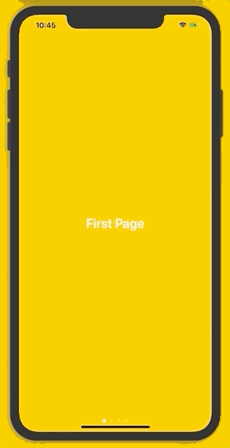

# PageView

This package contains a PageView purely written in SwiftUI.



## Getting Started

### Swift Package Manager

To download this package with Swift Package Manager, go in Xcode to _File > Swift Packages > Add Package Dependency..._. Search for _PageView_ and choose the one from Connapptivity. Then choose the version and the target and click _Finish_.

### CocoaPods

To use this package via CocoaPods just add `pod 'CAPageView'` to your pod file and run `pod install` in your terminal.

## Usage

PageView is easy to use, like any other View in basic SwiftUI. Simply write

```swift
PageView(pageCount: Int, currentIndex: Binding<Int>) {

    Text("Add your pages here!")
    
}
```

## Indicator

By default PageView shows a page indicator at the bottom of the page view to show users on which page they are. If you prefer hiding it you can simply doing this by adding 

```swift
.hideIndicator(Bool = true)
```

If you want to customize the indicator or change its position you can do this by adding

```swift
.indicator(position: IndicatorPosition = .bottomInBounds, current: UIColor? = nil, other: UIColor? = nil, background: Color? = nil)
```

## Contribute

This package is public, because everybody who wants to contribute should be able to do so. And we belive nothing is as powerful as community development. So, feel free to fork and add your code to this package.
